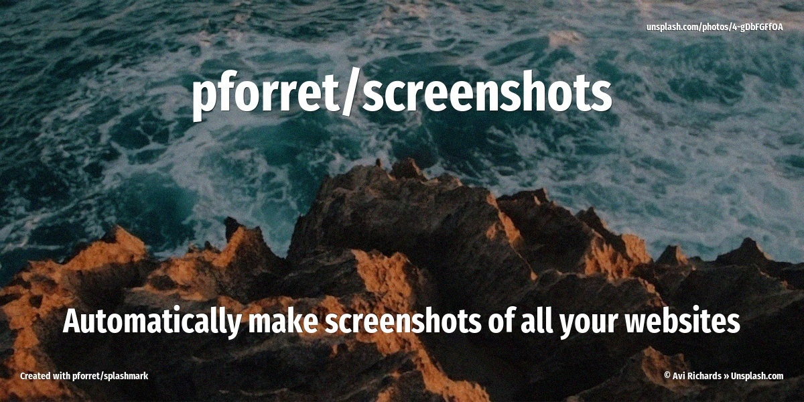
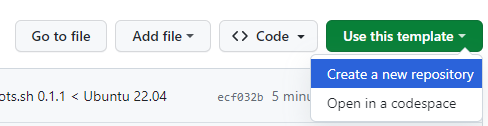
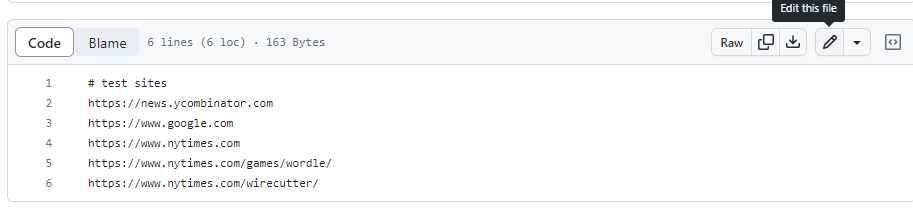

[](https://github.com/pforret/screenshots/actions/workflows/screenshots.yml)

# pforret/screenshots



Let GitHub automatically make screenshots of all your websites

## Usage 

Create new repo with this one as template




### Method 1 (CLI)
```bash
# clone the new repo to your local machine
git clone git@github.com:<your username>/<your repo>.git
cd <your repo>

# remove all images from the images folder
rm images/*.png

# replace the URLS in sites.txt by your own URLs
echo "https://www.yoursite.com" > sites.txt
echo "https://www.yourothersite.com" >> sites.txt
...

# check in the repo with changes
git -a -m "new sites"

# wait until Github Actions have run and created all your screenshots

# now get the updated image files
git pull
```

### Method 2 (GitHub UI)

Or just edit the `sites.txt` file on github.com




## Run locally

You can also run the screenshot process locally on your machine. You will need to install shot-scraper. 

```bash
# clone the new repo to your local machine
git clone git@github.com:<your username>/<your repo>.git
cd <your repo>

# install shot-scraper
pip install shot-scraper

# remove all images from the images folder
rm images/*.png

# replace the URLS in sites.txt by your own URLs
echo "https://www.yoursite.com" > sites.txt
echo "https://www.yourothersite.com" >> sites.txt
...

# check in the repo with changes
git -a -m "new sites"

# wait until Github Actions have run and created all your screenshots

# now get the updated image files
git pull
```

## Script screenshots.sh

```bash
Program : screenshots.sh  by peter@forret.com
Version : v1.0.0 (2023-05-16 15:16)
Purpose : take the screensots with shotscraper
Usage   : screenshots.sh [-h] [-q] [-v] [-f] [-l <log_dir>] [-t <tmp_dir>] [-o <out_dir>] [-d <delay>] [-w <width>] [-h <height>] [-x <export>] <action> <input?>
Flags, options and parameters:
    -h|--help        : [flag] show usage [default: off]
    -q|--quiet       : [flag] no output [default: off]
    -v|--verbose     : [flag] also show debug messages [default: off]
    -f|--force       : [flag] do not ask for confirmation (always yes) [default: off]
    -l|--log_dir <?> : [option] folder for log files   [default: log]
    -t|--tmp_dir <?> : [option] folder for temp files  [default: tmp]
    -o|--out_dir <?> : [option] output folder for screenshots  [default: images]
    -d|--delay <?>   : [option] seconds to wait for the git action to finish  [default: 80]
    -w|--width <?>   : [option] screenshot width  [default: 1920]
    -h|--height <?>  : [option] screenshot height  [default: 1080]
    -x|--export <?>  : [option] export list of screenshots in Markdown format  [default: index.md]
    <action>         : [choice] action to perform  [options: multi,gha:deploy,gha:update,check,env,update]
    <input>          : [parameter] input file/text (optional)
 
``` 

## Based on

* [github.com/features/actions](https://github.com/features/actions): Github Actions
* [simonw/shot-scraper](https://github.com/simonw/shot-scraper): Playwright based CLI screenshotting - which is based on
* [microsoft/playwright-python](https://github.com/microsoft/playwright-python): Playwright testing and automation library
* [pforret/bashew](https://github.com/pforret/bashew): bash micro-framework